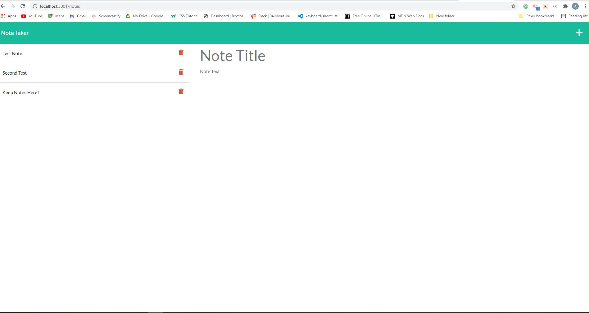

# Express Note Taker
    
## Description
An application for adding any notes you would like to save.

## Table of Contents
- [Usage](#Usage)
- [Installation](#Installation)
- [Usage](#Usage)
- [Contributing](#Contributing)
- [Screenshot](#Screenshot)
- [License](#License)
- [Questions](#Questions)
- [Languages](#Languages)

## Usage
You can use this program to quickly and effeciently create notes to save until you do not need to reference them anymore. 

## Installation
In the Express Note Taker folder, run an NPM install.   Next you can run "npm start" in the command line to generate the link.  Us Ctrl Click or Command Click to open the website. 

## Contributing 
Ashby Blakely 

## Screenshot

## License
MIT

## Questions
[Link to GitHub Profile](https://github.com/AshbyLB) 
Feel free to email me at ashbyleeblakely@gmail.com if you have any questions.

## Languages
HTML, JavaScript, Node, Express 
    